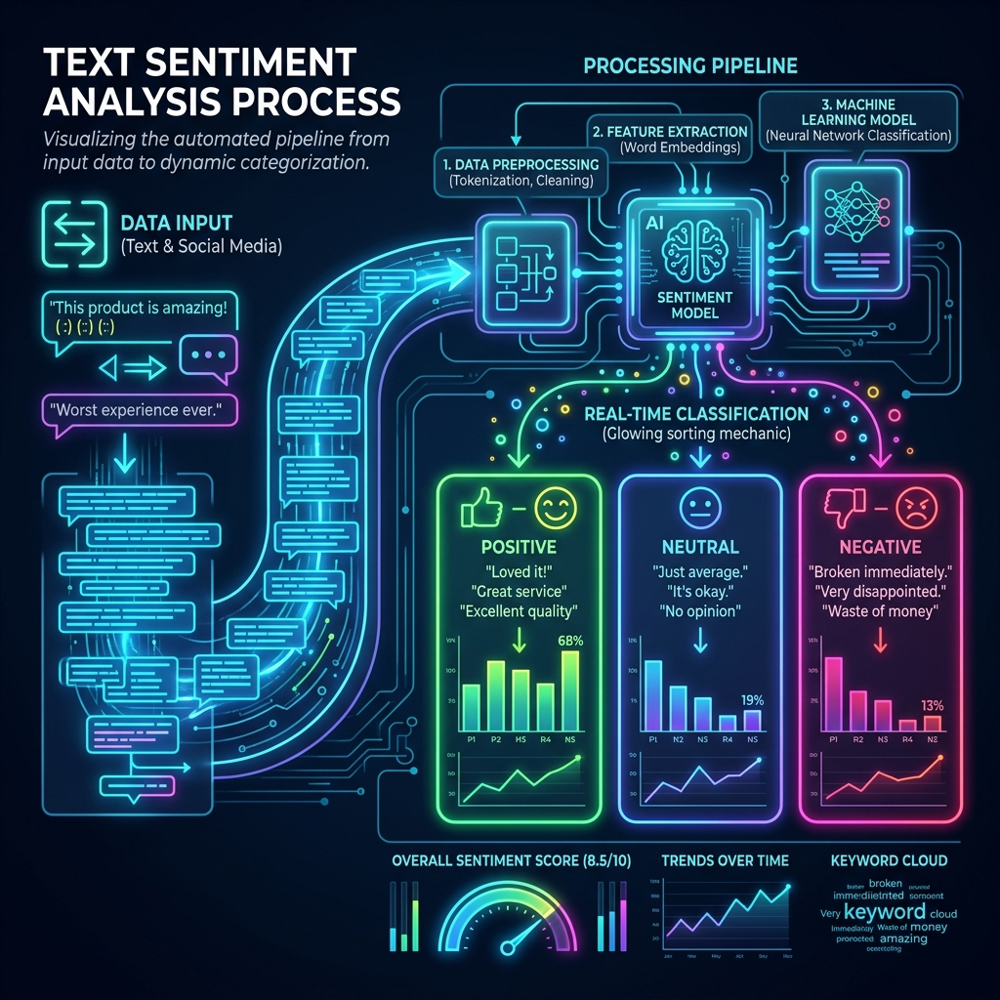
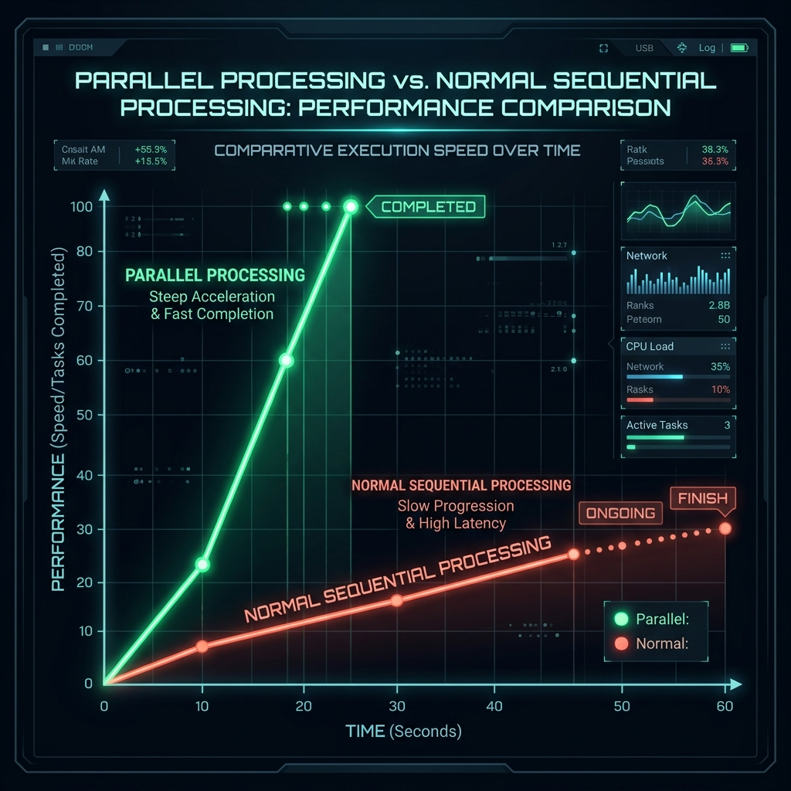
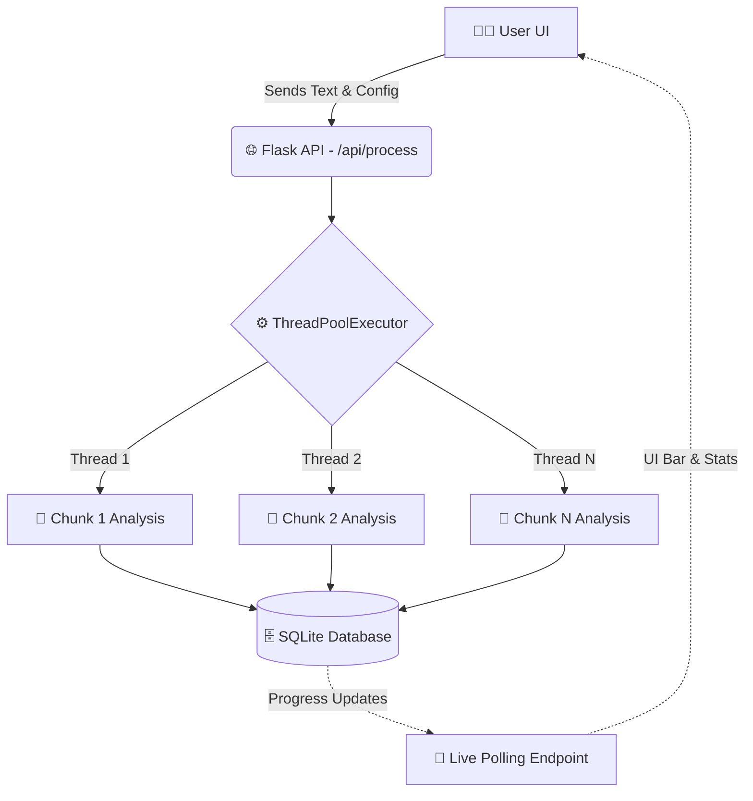

<div align="center">
  
  
  # ⚡ Parallel Text Processor & Sentiment Analysis ⚡
  
  **A high-performance, multi-threaded text analysis tool with a sleek, modern web UI.** 🚀
  
  <br>

  [](https://python.org)
  [](https://flask.palletsprojects.com/)
  [](https://sqlite.org)
  [](https://www.chartjs.org/)
  [](https://developer.mozilla.org/en-US/docs/Web/JavaScript)

  <br>
  <i>Built for processing massive text batches without breaking a sweat.</i>
</div>

---

## 📑 Table of Contents
- [🌟 Overview](#-overview)
- [🛠️ How It Works](#️-how-it-works-codebase-architecture)
- [💻 Tech Stack](#-tech-stack)
- [✨ Key Features](#-key-features)
- [🚀 Quick Start Guide](#-quick-start-guide)
- [🔌 API Reference](#-api-reference)

---

## 🌟 Overview

The **Parallel Text Processor** is a beautifully engineered, dynamic web application that allows you to analyze massive text datasets using advanced parallel processing techniques. By automatically chunking text into logical sentences or paragraphs and dynamically assigning them to a highly responsive pool of worker threads, it dramatically accelerates standard local sentiment analysis processes.

<br>
<div align="center">
  
  <br><br><br>
  <h3>⚡ Parallel vs Sequential Performance</h3>
  
  <br><br>
  <p><i>A conceptual timeline demonstrating the dramatic, exponential time-saving capabilities of analyzing chunks concurrently instead of linearly sequentially. Parallel threads drastically reduce analysis queue times.</i></p>
</div>
<br>

---

## 🛠️ How It Works (Codebase Architecture)

We employ a sophisticated, decoupled algorithmic backend architecture structured specifically for multithreading and robust background job execution, combined with a lightweight Vanilla JS frontend polling service.

<br>
<div align="center">
  
</div>
<br>



### 📂 Directory Structure

Our codebase is organized to separate concerns, making it incredibly intuitive and clean to extend or maintain:

*   **`app.py`** 🚦
    *   **The Hub**: Serves as the Entry point. Handles Flask routes, backgrounds job execution via `ThreadPoolExecutor`, and API endpoints for UI polling.
*   **`processor.py`** 🧠
    *   **The Brains**: Contains the core logic for splitting text (into paragraphs or sentences) and running the sentiment analysis algorithm. Calculates granular positive, negative, and neutral keyword scores.
*   **`database.py`** 💾
    *   **The Memory**: Provides persistence using SQLite3. Creates normalized tables, natively tracks isolated batch processing histories, stores chunk records, and powers high-speed data filtering and pagination.
*   **`mail.py`** 📧
    *   **The Messenger**: Handles secure, dynamic report dispatch via integrated email REST endpoints.
*   **`templates/ & static/`** 🎨
    *   **The Face**: Contains `index.html`, Javascript (`main.js`), and strictly CSS (`style.css`). Manages the vibrant dark-theme UI, intuitive Chart.js visualizations, and asynchronous REST interactions polling the backend.

---

## 💻 Tech Stack

- **Backend:** Python + Flask Web Framework
- **Concurrency:** `concurrent.futures.ThreadPoolExecutor`
- **Database:** SQLite3
- **Frontend Core:** HTML5, CSS3, Vanilla ES6 JavaScript
- **Visualizations:** Chart.js Library
- **Analytics/Networking:** Requests (for external email APIs)

---

## ✨ Key Features

| Feature                 | Description |
| :---                    | :--- |
| **🚀 Multi-threading**  | Harness exactly 2, 4, 8, or 16 isolated worker threads simultaneously for blistering processing speeds to crunch data walls. |
| **🔪 Smart Chunking**   | Seamlessly structure and split large text blobs cleanly either by individual `sentences` or grouped `paragraphs`. |
| **🧠 Sentiment Engine** | Advanced, lightweight dictionary/rule-based processing yields distinct positive/negative/neutral evaluations on text blocks. |
| **🗃️ Persistent Storage**| Robust SQLite3 backend seamlessly handles persistence, ensuring analysis histories are tracked across different job batches. |
| **📊 Live Dashboard**   | Pure async polling for rendering real-time progress bars, system logging, and statistical tracking—all without full page refreshes. |
| **📈 Context Charts**   | Dynamic data visualizations integrated tightly using Chart.js (Interactive Bars, Doughnut distributions, Histograms, and summary Gauges). |
| **📨 Automated Emails** | Out-of-the-box configuration allows analytical summaries to be dispatched directly to your inbox post-processing. |
| **📩 Export Controls**  | Granular result viewing combined with instant `.csv` text and data exportation for complex external spreadsheet tracking/mining. |

---

## 🚀 Quick Start Guide

Ready to process massive texts? Let's deploy the server locally in just 3 easy steps!

**1. Install Dependencies** 📦
```bash
# Clone the repository and install all required modules
pip install -r requirements.txt
```

**2. Ignite the Server** 🔥
```bash
# Start the local development server (runs by default on port 5000)
python app.py
```

**3. Launch the Dashboard** 🌍
Open your favorite browser and navigate to the local environment:
```bash
http://localhost:5000
```
> **💡 Tip:** To test functionality, try generating a long paragraph of text (lorem ipsum or an article) and paste it into the UI, setting threads to 16 for maximum processing speed!

---

## 🔌 API Reference

Easily integrate the underlying engine's functionality with external dashboarding tools using our built-in API.

| Method | Endpoint         | Body/Query            | Purpose |
| :---   | :---             | :---                  | :--- |
| `POST` | `/api/process`   | `{text, method, workers}` | 🚦 Queue and start a new background processing job with dynamic parameters. |
| `POST` | `/api/stop`      | *None*                | 🛑 Emergency halt the currently executing background job. |
| `GET`  | `/api/progress`  | *None*                | 📡 Poll live telemetry, including numerical progress %, chunks pending, and debug logs. |
| `GET`  | `/api/results`   | `?q=&sentiment=&limit=&offset=` | 🔍 Fetch stored, paginated dataset rows supporting dynamic filtering queries. |
| `POST` | `/api/clear`     | *None*                | 🧹 Completely truncate all records associated with previous executions. |
| `GET`  | `/api/export`    | `?q=&sentiment=`      | 📥 Streamingly generate and download a filtered `.csv` document of rows. |
| `POST` | `/api/send_email`| `{to, subject, body}` | ✉️ Dispatch insightful analytics summaries directly to target inboxes. |

---
<br>
<div align="center">
<i>Crafted for performance • Built with ❤️ using Python, Flask, and Vanilla JS.</i>
</div>
